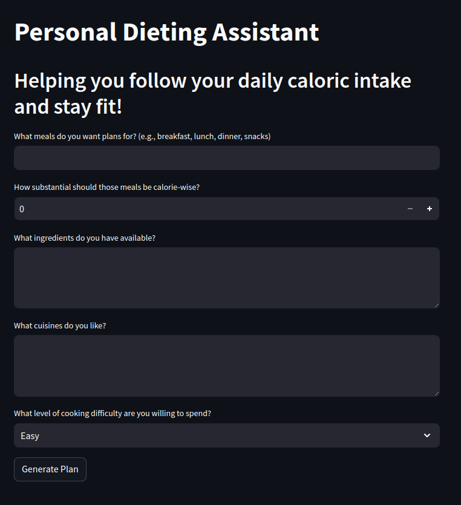

# AI-nception
## Allowing anyone to use AI to allow anyone to interact with AI

AI-nception is a cute little hackathon project for HackMIT! 

AI-powered applications are everywhere, and give everyone the chance to interact with AI, but the bottleneck to truly democratizing AI is that not everyone can develop AI apps themselves yet. AI-nception uses AI to code up AI-powered apps from just text instructions. It enables anyone, without any coding experience required (though coding experience will help edit it after AI-nception generates a fully working app), to build AI-apps, democratizing the power of creating with generative AI.

The coolest part of AI-nception is that if you ask it to make a "AI app generator that asks the user what they want to build and creates another streamlit app that employs GPT", it creates an equivalent working verison of itself :)

| If you enter                   | You get                        |
| ------------------------------ | ------------------------------ |
|  |  |
|  |  |

